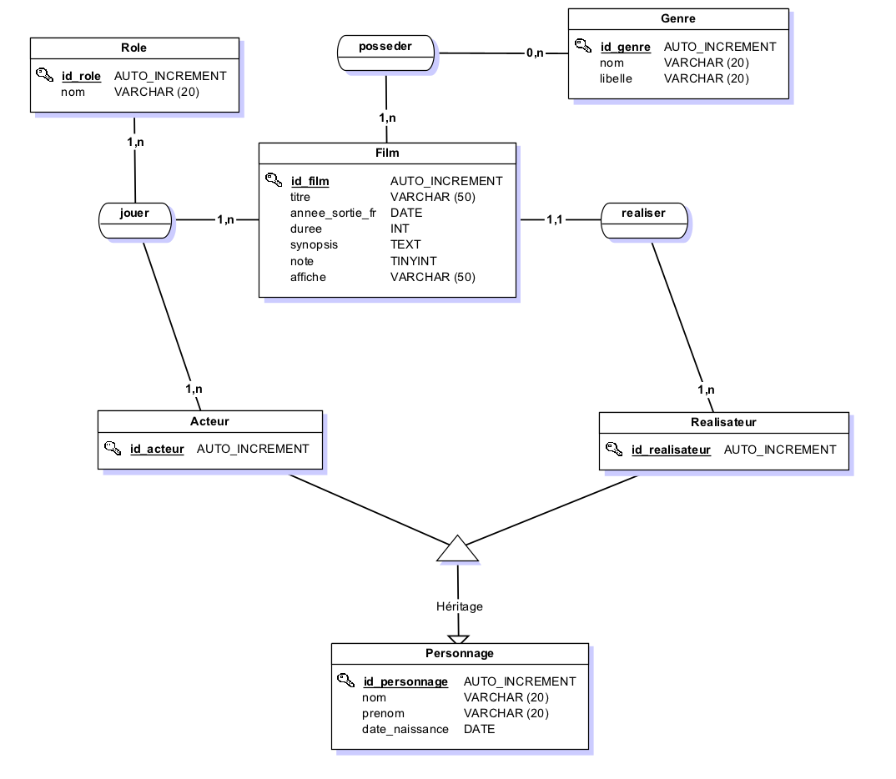

# Exercice Cinéma
But : Construire une BDD à partir d'un MCD et afficher ses données avec php.

## Mon MCD
| réalisé avec JMerise

## Ressources
- (Sur l'autoload en php)[https://supunkavinda.blog/php/autoload-classes-namespaces]